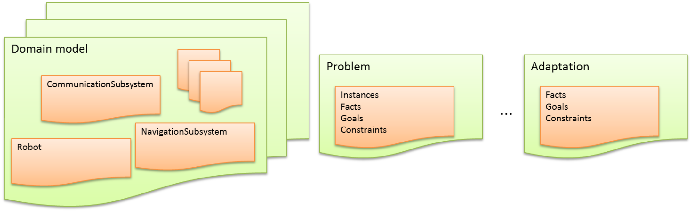

# The oRatio Domain Definition Language (RDDL)

This section describes the domain description language used, within the oRatio framework, to represent physical domains.
Compared to previous versions of the language (e.g., [Cesta and Oddi, 1996a](https://www.researchgate.net/publication/228818262_DDL_1_A_formal_description_of_a_constraint_representation_language_for_physical_domains)), the current proposal introduces a pure object-oriented approach to the definition of domain models and problem definitions.
It has been decided to move to an object-oriented approach mostly to allow an higher decomposition of the domain model, resulting in an increase of modularity and a consequent reduction of the the overall complexity at design phase.
Furthermore, thanks to the object-oriented approach, UML modeling features can be naturally exploited to enhance the design phase.
In addition, aspects related to first order logic are further made explicit, allowing a uniform representation of planning and scheduling concepts.
Finally, although the language is based on a multi-sorted first order logic core, from which the object-oriented approach comes, it has been designed for allowing extensibility.
As already mentioned, the scope concept represents the junction element between the logic based core and specialized resolution algorithms.

## An Object-Oriented Language

The basic core of the oRatio architecture provides an object-oriented virtual environment for the definition of objects and constraints among them.
Every object in the oRatio environment is an instance of a specific *type*.
oRatio distinguishes among *primitive types* (i.e., bools, ints, reals, enums and strings) and user defined *complex types* (e.g., robots, trucks, locations, etc.).
Within oRatio, a problem is composed of different *compilation units* (i.e., several files) that can possibly interact each other.
Each compilation unit can contain several declarations of different types and/or statements.
Such units are given to the solver in different sorted *groups* (i.e., a list of lists of files).

Furthermore, these groups can be sent to solver at different times so as to provide plan adaptation features.
Although not strictly required, it is common practice to separate the type declarations from the statements in different units (e.g., a first unit for type declarations and a second unit for statements).
Furthermore, type declarations can be spread on different units so as to improve model decomposition.
In this regard, we tried to facilitate the definition of the domains by internally implementing forward declaration.
Specifically, types, methods and predicates can be used before of being declared, under the obvious assumption that these types (methods and predicates) are defined sooner or later within the same group of units within which the type (method or predicate) is used (or, alternatively, in a group previously sent to the solver).
This same argument does not apply to statements which, on the contrary, are executed sequentially.
Hence it is not possible, for example, to use a variable which has not yet been declared.

To sum up, the suggested methodology, as summarized in the following image, consists in providing to the solver a set of compilation units containing the definition of types, methods and predicates, so as to inform the solver of the domain model on which it will have to reason.
At a later time, a new compilation unit is provided to the solver containing the statements relative to the declaration of the instances, the facts and the goals.
At this point, if a solution to the proposed problem exists, the solver will be able to find it and will return `true`, if not, it and will return `false`.
Finally, if needed, the solution can be adapted, several times, by providing further compilation units.



### Identifiers

The names of variables, constants, methods, predicates, as well as types and objects, are called *identifiers*.
A valid identifier for our domain description language is a sequence of one or more letters, digits, or underscore characters (`_`).
Spaces, punctuation marks, and symbols cannot be part of an identifier.
In addition, identifiers shall always begin either with a letter or with an underline character (`_`).

The domain description language uses a number of keywords to identify operations and data descriptions; therefore, identifiers created by a domain modeler cannot match these keywords.
The standard reserved keywords that cannot be used as identifiers are:
`bool`, `class`, `enum`, `fact`, `false`, `goal`, `new`, `or`, `predicate`, `real`, `return`, `string`, `this`, `true`, `typedef`, `void`

It is worth to notice that the domain description language is a "case sensitive" language.
This means that an identifier written in capital letters is not equivalent to another one with the same name but written in small letters.
For example, the variable names `MAX` and `max` will be considered as separate identifiers.
Here are some examples of identifiers:

```
i
MAX
max
first_name
_second_name
```

### Primitive types

The domain description language is a strongly-typed language therefore it requires every variable to be declared with its type before its first use.
The oRatio framework needs to have precise information about the type of the variable we want to define.
If we want to represent a number, for example, the framework needs to know that the declared variable represents a number and, furthermore, needs to know the specific type of the number (i.e., either an integer or a real).

The simplest way for declaring and instantiating a variable is through the syntax `<type>` `<id>` that declares a variable of type `<type>` and identifier `<id>`.
If it is needed to declare more than one variable of the same type, they can all be declared in a single statement by separating their identifiers with commas.
Once declared, the variables can be used within the rest of their scope in the program.
Unless explicitly specified, the variable will assume a default initial domain which is based on the type of the variable.
It is worth to note that, unlike an ordinary programming language, like Java or C++, rather than assuming a value, variables assume a domain of values, therefore the semantic is similar to the variables of a CSP (refere to [ac-lib](ac.md) for further details).

The domain description language provides a set of primitive types that allow us to define basic types of variables.
Primitive types for our domain description language are: `bool`, `int`, `real`, `string`, `typedef` and `enum`.

#### bool

The boolean type is the simplest type provided by the domain description language.
Booleans are used to represent boolean states (i.e., `true` and `false`).
Unless explicitly specified, a boolean variable will assume possible values within the set `{true, false}`.
This means that the allowed values of the variable is neither `true` nor `false` but it is decided by the solver according to the current constraints.
For example, in the limit case in which no constraint insists on the variable, the domain of the variable will be maintained equal to the set `{true, false}`.

#### int

The integer type is used to represent the set of integers, so to speak "without comma", positive and negative (e.g., 1, 2, 43, -89, 4324).
The internal representation format of integers (i.e., 16 bits, 32 bits, arbitrary-precision, etc.) is dependent on the implementation of the framework and is beyond the description of the language.
Unless explicitly specified, an integer variable will assume possible values within the bounds `[-inf, +inf]`.
Similar to the boolean variables, the allowed values of integer variables is decided by the solver according to the current constraints.

#### real

The real type is used to represent the set of reals, so to speak "with comma", positive and negative (e.g., 2.7, -3.14, 15.3).
Similarly to the integers, the internal representation format of reals (i.e., 16 bits, 32 bits, arbitrary-precision, etc.) is dependent on the implementation of the framework and is beyond the description of the language.
Unless explicitly specified, a real variable will assume possible values within the bounds `[-inf, +inf]`.
This means, again, that the allowed values of the variable is decided by the solver according to the current constraints.

#### string

In order to represent texts, the domain description language provides the `string` type.
Unless explicitly specified, a string variable will assume the empty string value (i.e., "").

#### typedef

The purpose of `typedef` is to assign alternative names to existing primitive types and possibly to redefine them
 This allows us, for example, to define a primitive type called `Angle` which might be a real whose allowed values are within the bounds `[0, 360]`.
In general, `typedef`s are utility constructs that allow the definition of more synthetic code.
Indeed, the same behavior can be achieved by defining primitive type variables and imposing constraint on it.

#### enum

When defining an enumerated type variable, it is assigned a set of constants called enumeration set.
The variable can assume any of the constants of the enumeration set.
Unless explicitly specified, an enum variable will assume possible values within the constants of the enumeration set.
This means that the allowed values of the variable is decided by the solver according to the current constraints, yet will contain some (or all) of the constants of the enumeration set.

### Creating primitive type instances

The following code snippet shows the definition of some primitive type variables:

```
//Primitives with (default) initial domains

int x0; // Declares an int variable x0 with initial domain [-inf +inf]
real x1; // Declares a real variable x1 with initial domain [-inf +inf]
bool x2; // Declares a bool variable x2 with initial domain {true, false}

// Enumerative custom type
enum Speed {"High", "Medium", "Low"};

// Declares a variable x3 with possible values {"High", "Medium", "Low"}
Speed x3;

// Custom type definitions
typedef int [0, 360] Angle;
Angle x4; // Declares an Angle (int) variable x7 with initial domain [0, 360]
```

Specifically, the first row defines an integer variable `x0` with initial domain `[-inf +inf]`.
Follows the definition of a real variable `x1` with initial domain `[-inf +inf]` and a boolean variable `x2` with initial domain `{true, false}`.
An enum type, called `Speed`, is defined for allowing the creation variables representing the speed as, for example, the `x3` variable, whose initial domain is the set `{High, Medium, Low}`.
Finally, a typedef called `Angle` is defined as an integer whose initial domain is within bounds `[0, 360]`.
The code snippet is closed with the definition of an `x4` variable of type `Angle`.
Since none of these variables is subject to any constraint, their domain, at the end of the execution of the code snippet, will remain untouched.

### Operators

Once variables and constants have been introduced, we can begin to operate with them by using *operators*.
We use operators to impose constraints on declared variables.
What follows is a complete list of operators.

#### Assignment operator (`=`)

The assignment operator assigns a value to a variable.
For example

```
x = 5;
y = [0, 20];
```

assigns the value `5` to the variable `x` and the domain `[0, 20]` to the variable `y`.
The assignment operation always takes place from right to left, and never the other way around.
For example

```
x = y;
```

assigns the value `y` to variable `x`.
The value of `x`, at the moment this statement is executed, is lost and replaced by `y`.

It is worth noticing that we are assigning `y` to `x` therefore, if `y` changes at a later moment, it will reflect on the value taken by `x` and the other way around.
Variables `x` and `y` will represent exactly the same object after this assignment statement is executed.

The assignment operator can be used, also, during variable declaration for assigning to variables an initial domain through the syntax `<type> <id> = <expr>`.

#### Arithmetic operators ( `+`, `-`, `*`, `/` )

Operations of addition, subtraction, multiplication and division correspond literally to their respective mathematical operators.
The semantic, however, is taken by interval arithmetic.
Specifically, arithmetic operations are defined as:

 * [x<sub>0</sub>, x<sub>1</sub>] + [y<sub>0</sub>, y<sub>1</sub>] = [x<sub>0</sub> + y<sub>0</sub>, x<sub>1</sub> + y<sub>1</sub>]
 * [x<sub>0</sub>, x<sub>1</sub>] - [y<sub>0</sub>, y<sub>1</sub>] = [x<sub>0</sub> - y<sub>0</sub>, x<sub>1</sub> - y<sub>1</sub>]

## The Extended Backus-Naur form

This section presents the complete grammar of the language in its Extended Backus-Naur form.

```
<compilation_unit>          ::= (<type_declaration> | <method_declaration> | <predicate_declaration> | <statement>)*

<type_declaration>          ::= <typedef_declaration>
                              | <enum_declaration>
                              | <class_declaration>

<typedef_declaration>       ::= 'typedef' <primitive_type> <expr> <ID> ';'

<enum_declaration>          ::= 'enum' <ID> <enum_constants> ('|' <enum_constants>)* ';'

<enum_constants>            ::= '{' StringLiteral (',' StringLiteral)* '}'
                              | <type>

<class_declaration>         ::= 'class' <ID> (':' <type_list>)? '{' <member>* '}';

<member>                    ::= <field_declaration>
                              | <method_declaration>
                              | <constructor_declaration>
                              | <predicate_declaration>
                              | <type_declaration>

<field_declaration>         ::= <type> <variable_dec> (',' <variable_dec>)* ';'

<variable_dec>              ::= <ID> ('=' <expr>)?

<method_declaration>        ::= 'void' <ID> '(' <typed_list>? ')' '{' <block> '}'
                              | <type> <ID> '(' <typed_list>? ')' '{' <block> '}'

<constructor_declaration>   ::= <ID> '(' <typed_list>? ')' (':' <initializer_element> (',' <initializer_element>)*)? '{' <block> '}'

<initializer_element>       ::= <ID> '(' <expr_list>? ')'

<predicate_declaration>     ::= 'predicate' <ID> '(' <typed_list>? ')' (':' <type_list>)? '{' <block> '}'

<statement>                 ::= <assignment_statement>
                              | <local_variable_statement>
                              | <expression_statement>
                              | <disjunction_statement>
                              | <formula_statement>
                              | <return_statement>
                              | '{' block '}'

<block>                     ::= <statement>*

<assignment_statement>      ::= (<qualified_id> '.')? <ID> '=' <expr> ';'

<local_variable_statement>  ::= <type> <variable_dec> (',' <variable_dec>)* ';'

<expression_statement>      ::= <expr> ';'

<disjunction_statement>     ::= <conjunction> ('or' <conjunction>)+

<conjunction>               ::= '{' <block> '}' ('[' <expr> ']')?

<formula_statement>         ::= ('goal' | 'fact') <ID> '=' 'new' (<qualified_id> '.')? <ID> '(' <assignment_list>? ')' ';'

<return_statement>          ::= 'return' <expr> ';'

<assignment_list>           ::= <assignment> (',' <assignment>)*

<assignment>                ::= <ID> ':' <expr>

<expr>                      ::= <literal>
                              | '(' <expr> ')'
                              | <expr> ('*' <expr>)+
                              | <expr> '/' <expr>
                              | <expr> ('+' <expr>)+
                              | <expr> ('-' <expr>)+
                              | '+' <expr>
                              | '-' <expr>
                              | '!' <expr>
                              | qualified_id
                              | (<qualified_id> '.')? <ID> '(' <expr_list?> ')'
                              | '(' <type> ')' <expr>
                              | '[' <expr> ',' <expr> ']'
                              | 'new' <type> '(' <expr_list>? ')'
                              | <expr> '==' <expr>
                              | <expr> '>=' <expr>
                              | <expr> '<=' <expr>
                              | <expr> '>' <expr>
                              | <expr> '<' <expr>
                              | <expr> '!=' <expr>
                              | <expr> '->' <expr>
                              | <expr> ('|' <expr>)+
                              | <expr> ('&' <expr>)+
                              | <expr> ('^' <expr>)+

<expr_list>                 ::= <expr> (',' <expr>)*

<literal>                   ::= <NumericLiteral>
                              | <StringLiteral>
                              | 'true'
                              | 'false'

<qualified_id>              ::= ('this' | <ID>) ('.' <ID>)*;

<type>                      ::= <class_type>
                              | <primitive_type>

<class_type>                ::= <ID> ('.' <ID>)*

<primitive_type>            ::= 'real'
                              | 'bool'
                              | 'string'

<type_list>                 ::= <type> (',' <type>)*

<typed_list>                ::= <type> <ID> (',' <type> <ID>)*

<ID>                        ::= ('a'..'z'|'A'..'Z'|'_') ('a'..'z'|'A'..'Z'|'0'..'9'|'_')*

<NumericLiteral>            ::= [0-9]+ ('.' [0-9]+)?
                              | '.' [0-9]+

<StringLiteral>             ::= '"' (ESC|.)*? '"'

<ESC>                       ::= '\\"' | '\\\\'
```